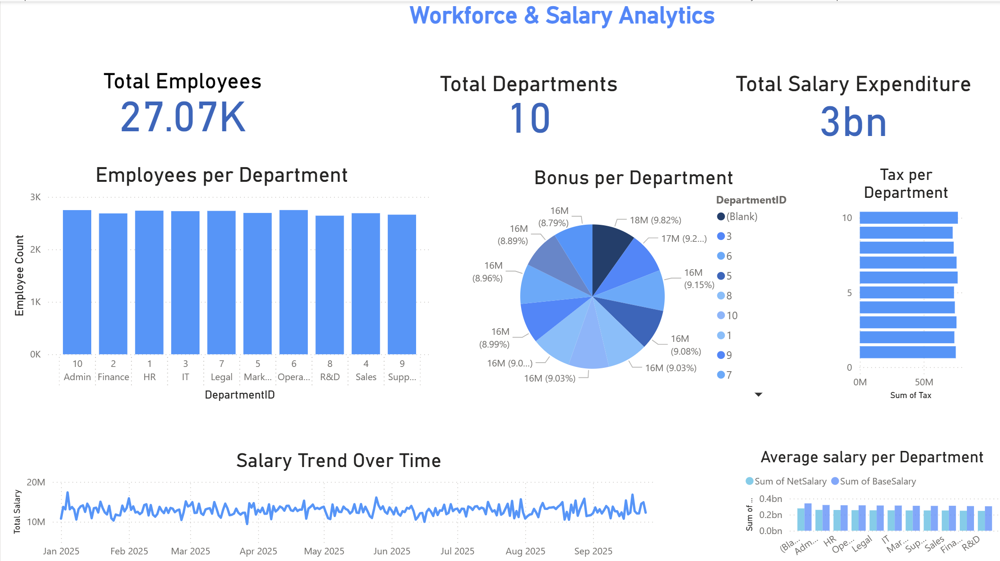

# 📊 Workforce & Salary Analysis Dashboard (Power BI)

## 📌 Project Overview
This project is my **first Power BI dashboard**, created to analyze workforce and salary-related data across multiple departments.  
The dashboard focuses on presenting clear, interactive, and easy-to-understand insights for workforce analytics.

---

## 🎯 Objective
The main objective of this project is to:
- Analyze employee distribution across departments  
- Understand salary expenditure and trends over time  
- Compare bonuses, taxes, and average salaries by department  

---

## 🛠 Tools & Technologies
- **Power BI**
- **Data Cleaning & Transformation**
- **Basic DAX Measures**
- **Data Visualization & Dashboard Design**

---

## 📊 Dashboard Features
- Total Employees overview  
- Total Departments count  
- Total Salary Expenditure  
- Employees per Department (Bar Chart)  
- Bonus per Department (Pie Chart)  
- Tax per Department (Bar Chart)  
- Salary Trend Over Time (Line Chart)  
- Average Salary per Department (Comparison Chart)  

---

## 📈 Key Insights
- Workforce is fairly evenly distributed across departments  
- Salary expenditure shows a stable trend over time  
- Bonuses and taxes vary slightly across departments  
- Average salary comparison highlights differences among departments  

---

## 📁 Repository Structure
- `Dashboard.pbix` – Power BI dashboard file    
- `screenshots – Dashboard preview image  


```markdown

